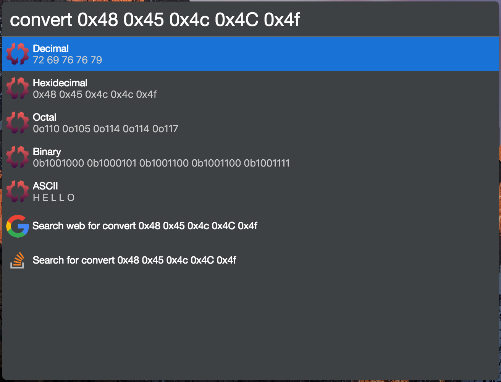

# cerebro-plugin-convert

> [Cerebro](https://cerebroapp.com) plugin to numbers to different bases.

## Usage

In Cerebro, type `convert` and see the converted values in the list below.

## Installing

* Type `plugins convert` into Cerebro
* Click `install`

## Motivation

This plugin was inspired by my need to convert between decimal, hexidecimal, and ASCII all the time on my haker projects.

## Related

- [Cerebro](http://github.com/KELiON/cerebro) – main repo for Cerebro app;

## License

MIT © [Matthew Jacobs](https://www.mattjdev.com)
